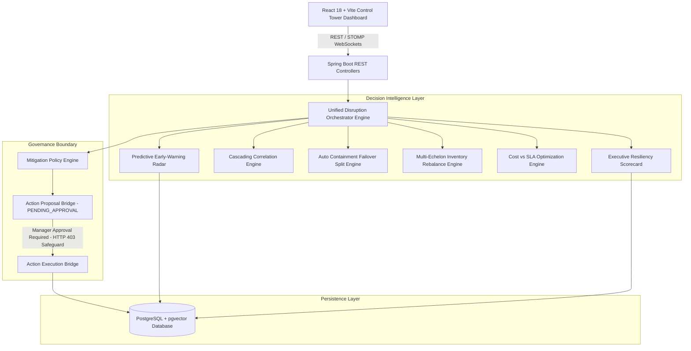

# AI Supply Chain Control Tower 🚀

An enterprise-grade, real-time AI-powered Supply Chain Control Tower built with **Spring Boot 3.3.4 (Java 21)**, **Spring AI (ONNX / MiniLM-L6-v2 Embeddings)**, **PostgreSQL (pgvector)**, **React 18**, and **Docker Compose**.

The system transforms supply chain management from reactive triage into proactive, deterministic, and explainable decision intelligence across global multi-echelon networks.

---

## 🌟 Executive Overview & Key Capabilities

The Control Tower integrates 16 specialized decision-intelligence analytics engines:

1. **RAG Vector Knowledge Search**: Semantic similarity search over operational manuals and supply chain policies using ONNX vector embeddings.
2. **Multi-Agent Supervisor Consensus**: Collaborative multi-agent system (`SupervisorAgent`, `InventoryAgent`, `SupplierAgent`, `LogisticsAgent`, `WarehouseAgent`, `RiskAgent`).
3. **Disruption Stress-Testing Simulator**: Simulates multi-domain supply chain shocks across demand surges, lead time delays, and capacity bottlenecks.
4. **Multi-Domain Risk Analysis Engine**: Evaluates supplier OTIF, warehouse utilization, stockout risks, and logistics delays.
5. **Automated Mitigation Policy Engine**: Formulates risk-mitigation proposals in `PENDING_APPROVAL` status.
6. **Human-in-the-Loop Manager Authorization Boundary**: Real-world consequential action execution strictly requires manager JWT Bearer token authorization (`POST /api/actions/{id}/approve`).
7. **Policy Action Execution Bridge**: Executes approved actions and generates purchase orders or stock transfers.
8. **Automated Purchase Order Replenishment**: Computes economic order quantities (EOQ) and issues purchase orders.
9. **Post-Recovery Residual Risk Evaluation**: Evaluates post-execution risk reduction ($75.0 \rightarrow 18.0$, band `LOW`).
10. **Cascading Disruption Correlation & Risk Topology**: Maps multi-hop disruption propagation chains (Supplier $\rightarrow$ Warehouse $\rightarrow$ Logistics $\rightarrow$ Customer SLA).
11. **Predictive Disruption Early-Warning Radar**: Detects stockout anomalies 2-to-5 days before escalation.
12. **Cost vs. SLA Speed Optimization**: Ranks mitigation options by ROI, cost, lead time, and customer SLA protection ($98.5\%$).
13. **Historical Mitigation Effectiveness Analytics**: Analyzes historical recovery success rates ($91.8\%$) across disruption categories.
14. **Executive Command Center & Resiliency Scorecard**: Computes the overall Supply Chain Resiliency Index ($94.7/100$ `OPTIMAL`).
15. **Automated Disruption Containment & Failover Split Router**: Computes $60/40$ multi-supplier order volume allocations during vendor outages.
16. **Multi-Echelon Inventory Rebalancing Engine**: Computes cross-dock inter-hub stock transfers (saving $\$14,500$ vs new vendor procurement).

---

## 🏗 System Architecture



---

## 🚀 Quickstart & Docker Deployment

### Prerequisites
- Docker & Docker Compose
- Java 21 (optional, for local maven builds)
- Node.js 20+ (optional, for local frontend development)

### 1. Launch Complete Application Stack
```bash
docker compose up -d
```

### 2. Service Access Points
- **Frontend Dashboard**: `http://localhost:3000`
- **Backend REST API**: `http://localhost:8080`
- **Actuator Health**: `http://localhost:8080/actuator/health`
- **PostgreSQL Vector DB**: `localhost:5432` (`controltower` / `postgres`)

---

## 🛠 REST API Key Endpoints

| Method | Endpoint | Description |
| :--- | :--- | :--- |
| `GET` | `/api/public/simulation/executive/command-center` | Returns Executive Resiliency Scorecard ($94.7/100$ `OPTIMAL`) |
| `GET` | `/api/public/simulation/analytics/unified-orchestration` | Generates Master Disruption Containment & Recovery Blueprint |
| `GET` | `/api/public/simulation/analytics/failover-containment` | Returns 60/40 multi-supplier failover allocation ratios |
| `GET` | `/api/public/simulation/analytics/multi-echelon-rebalance` | Computes inter-hub stock transfers (saving $\$14,500$) |
| `GET` | `/api/public/simulation/analytics/cost-sla-tradeoff` | Evaluates cost vs SLA speed optimization matrix |
| `GET` | `/api/public/simulation/analytics/predictive/early-warnings` | Scans stream for 2-to-5 day stockout anomalies |
| `POST`| `/api/actions/{id}/approve` | **Requires Manager JWT** (Returns `HTTP 403` unauthenticated) |

---

## 🧪 Testing & Verification

### Run Backend Unit & Integration Suite
```bash
cd backend
mvn test
```
*Result*: `Tests run: 109, Failures: 0, Errors: 0, Skipped: 0` $\rightarrow$ `BUILD SUCCESS`.

### Run Frontend Production Build
```bash
cd frontend
npm run build
```
*Result*: `built in ~300ms` (0 TypeScript/Vite compilation errors).

---

## 🔒 Security & Governance Safeguards
Consequential action execution (purchase order placement, stock movement, vendor switching) STILL strictly requires manager JWT Bearer token authorization via `POST /api/actions/{id}/approve`. Unauthenticated execution requests return `HTTP 403 Forbidden`.
